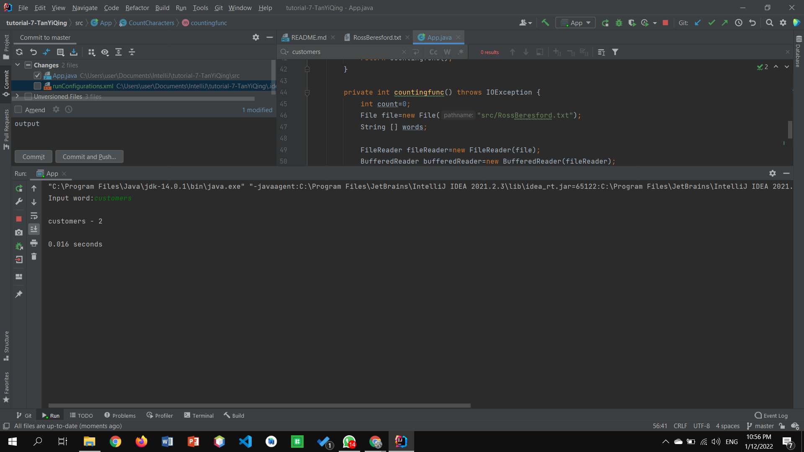

## Your Info:
1. Matric Number: 270607
1. Name: Tan Yi Qing

## Instruction:

1. Write a Java program to count and display matching words from the `RossBeresford.txt` below:

   https://github.com/STIW3054-A211/Template-Tutorial-7/blob/master/src/RossBeresford.txt

1. Your program should implement `Callable` and `Future` interfaces.

1. The word must be input from the keyboard.

1. Calculate the execution time.

1. The program file and the class name which has the main method should be named `App.java` and place in the `src` folder.

1. Screenshot the result and upload to this repo too.

1. Watch the video to clone, add, commit and push a repository to GitHub: https://youtu.be/RXV3Yusr0SI

## Example of the output
```
Input word: customers

customers - xx

Execution time: 0.005 seconds
```

## Your Output/Result


